# Music Visualiser Project


# Description of the assignment
- Music Visualiser Project for Object Oriented Programming (OOP) 2024 Semester 2

- (Patrick, Ruben, Jeff, Cormac, Sam)

- multiple audio visualisations that react to the frequency of the music

- each visualisation includes multiple different elements that are reactive to the music

- Scenes are controlled using num keys 1-9


Name: Patrick Fahy

Student Number: C22394713

# How it works
- My First Scene is the Dog with the Large Text that reads "WE'VE GOT TO TRY" as this is the name of the song we are using [hyperlink](https://www.youtube.com/watch?v=mRfSM-lv55I)

- The reason I used the dog as a centerpiece of this scene is because the music video focuses on the story of a dog and how he learns to drive and travels through space.

- My Second Scene is the 3-D Rotating Sphere covered in a mesh grid, which has audio waveforms eminating from both poles of the sphere in both directions. 

- The reason I used this as my second scene is because it looks like the road the dog used to travel through space, and gives a lot of depth to the space around the globe, creating a psychadelic endless highway effect.

# What I am most proud of in the assignment
- I'm most proud of the creative aspect of this project, I was able to express my creativity through the visualisations. I had very specific original ideas which I wanted to carry out and I managed to execute them within the best of my ability.

# Headings
## Headings
#### Headings
##### Headings

This is code for the Dog:

```Java
public void gotToTry() {
    v.beat.detect(v.ap.mix);
    // Check if a second has passed since the last beat
    if (v.millis() - v.lastBeatTime >= 10) {
        if (v.beat.isOnset()) {
            v.background(0); // Change background on beat (once per second)
        }
        v.lastBeatTime = v.millis(); // Update last beat time
    }
    //background(0);
    v.lights();
    float tot = 0;

    for(int i = 0 ; i < v.ap.mix.size() *0.8; i ++)
    {
        tot += v.abs(v.ap.mix.get(i));
    }

    float avg = tot / v.ap.mix.size();
    lerpedAvg = v.lerp(lerpedAvg, avg, 0.1f);
   
    v.pushMatrix();
    v.translate(v.width/2, v.height/1.5f);
    v.rotate(-v.PI);
    v.rotateY(v.theta/2);
    v.scale(2.0f);
    v.shape(v.ball);
    v.popMatrix();
   
   v.fill(v.bgcolor % 255, 255, 255, 100); // Adjust transparency as needed
   String myText = "WE'VE GOT TO TRY";
   v.pushMatrix();

   float textWidth = v.textWidth(v.myText);
    float textHeight = v.textAscent();
    float spacingX = textWidth + 5; // Adjust spacing as needed (5 is for gap between characters)
    float spacingY = textHeight + 5; // Adjust spacing as needed (5 is for gap between lines)
    v.translate(v.width/2, v.height/1.5f);
    v.rotateY(v.theta/2); 

    for (int y = 0; y < v.height; y += spacingY) {
        for (int x = 0; x < v.width; x += spacingX) {
            v.text(v.myText, x, y);
            v.text(v.myText, -x, -y);

        }
    }
    v.popMatrix();
    v.theta += 0.01f + tot/1625;
    v.bgcolor += 0.3 + tot/2;
 }
```


This is code for the Sphere:

```Java
public void BufferSphere()
    {    
        float y = 400;
        float bufferIndex = 0.0f; // Index for smooth looping within the buffer
        PVector lightPosition = new PVector(v.width / 2, v.height / 2, 200);
        float angle = 0; 
        //colorMode(HSB);
        v.background(0);
        v.stroke(v.bgcolor % 255, 255, 255);

        v.lights();
        //background(bgcolor % 255, 255, 255);
        v.background(0);

        // Move light position around the object
        float radius = 200;
    
        v.lightPosition.x = v.width / 2 + PApplet.cos(angle) * radius;
        v.lightPosition.y = v.height / 2 + PApplet.sin(angle) * radius;

        // Update angle for next frame
        angle += 0.01;
        v.bgcolor += 0.3;

        float tot = 0;
        for(int i = 0 ; i < v.ap.mix.size() *0.8; i ++)
        {
            tot += PApplet.abs(v.ap.mix.get(i));
        }

        float avg = tot / v.ap.mix.size();

        // Draw the object (sphere)
        v.translate(v.width / 2, v.height / 2);
        v.rotateY(v.frameCount * 0.01f);
        v.rotateX(v.frameCount * 0.01f);
        v.fill(200, 50, 50);
        v.sphereDetail(30);
        v.sphere(tot);
        
        // Set light position
        v.pointLight(255, 255, 255, v.lightPosition.x, v.lightPosition.y, v.lightPosition.z);

        float h = v.height / 2;
        //float w = width / (float) b.size(); // Width of each segment
        for(int i = 0 ; i < v.width*6; i ++)
        {
            bufferIndex += 0.6f; // Adjust value for line length  +  to get "Speedlines" effect
            float value = v.ap.mix.get((int) Math.floor(bufferIndex) % v.ap.mix.size()); //get buffer values

            float hue = PApplet.map(i, 0, v.ap.mix.size() , 0, 256);
            v.stroke(v.bgcolor % 255, 255, 255);
            v.noFill();
            v.line(i, h, i, h + value * h); // Top waveform line
            v.line(v.width - i, h, v.width - i, h + value * h); // Mirrored waveform line on the opposite side
            v.line(i, -h, i, -h + value * -h);// Draw line on the opposite pole
            v.line(v.width - i, -h, v.width - i, -h + value * -h); // Mirrored waveform line on the opposite side
        }
    }
```


These are screenshots of my second Scene:

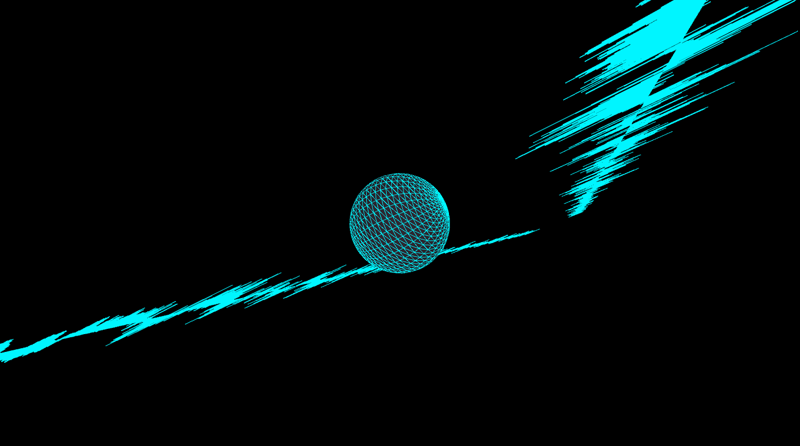

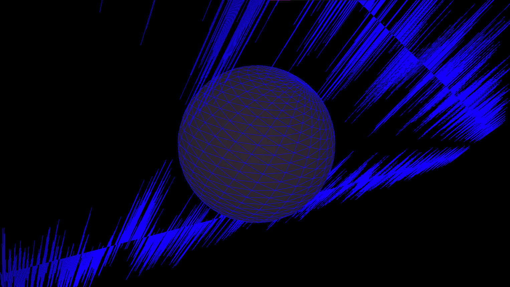

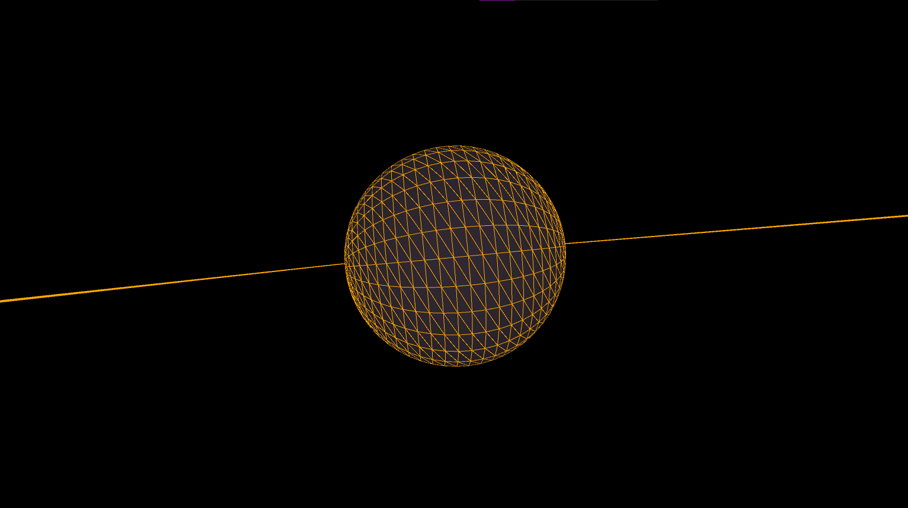

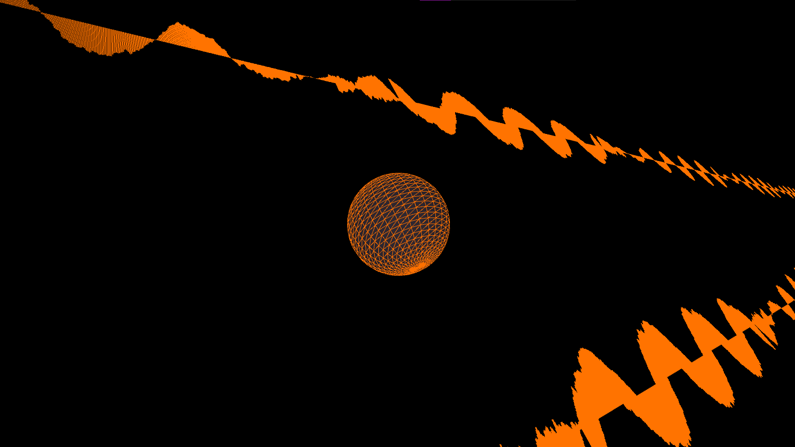

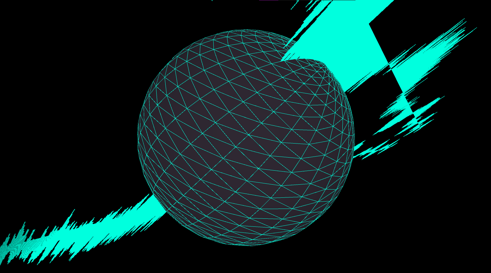


These are screenshots of my Second Scene:

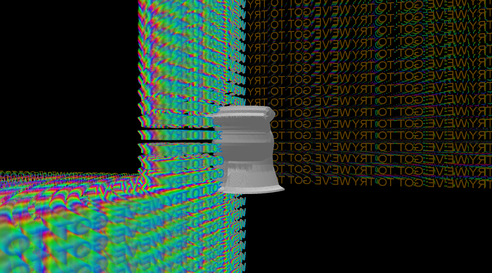

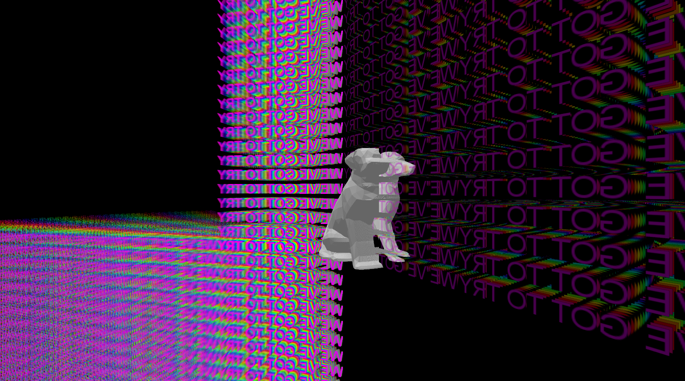

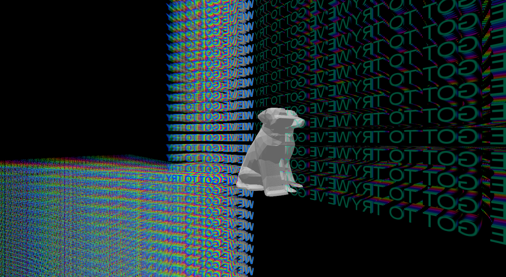

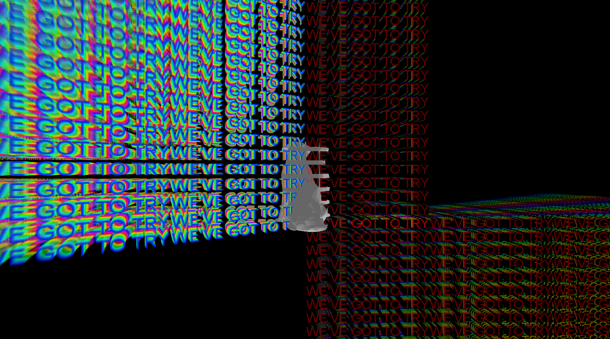

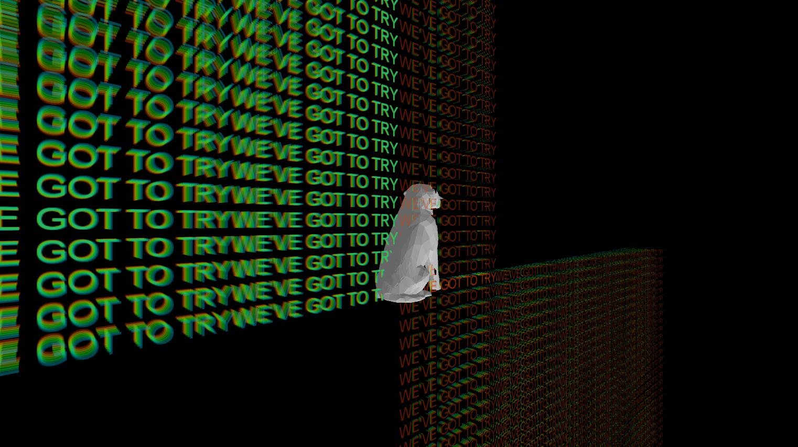


This a link to the 'We've Got to Try' Music video on Youtube [hyperlink](https://www.youtube.com/watch?v=mRfSM-lv55I)


This is the youtube video:

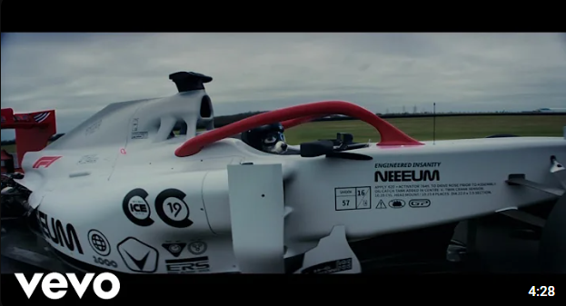


# Music Visualiser Project

Name: Jeff keenan 

Student Number: C22717891

# How it works
The camera roatates and cubes are displayed in the centre when the amplitued of the song is greater than the average amplitute.The cubes expand and contract by making the size of the cube depented on the smoothed aplitute of the song.I made lines extending from both sides of the cube to give a spinning effect.
This is code for the cameras and the cubes:

```java code for the camera rotation and displaying of the cubes 
    if(v.ap.mix.get(i) > (avg))
    {
        v.rotateY(v.frameCount * 0.0004f);
        v.rotateX(v.frameCount * 0.002f);
        v.stroke(bgcolor % 255, 255, 255);
        v.fill(200, 200, 200);
        v.box(cubeSize);
    }
```

```java code for lines drawn from the center cubes

            // Draw a lines from both sides of the cube
            v.line(0,0,100,100);
            v.line(100,100,-100,-100);
```

I wanted to create a spiral like visual around the cube so i created elipses that had expanding widths based on the amplitute of the song and drew lines extending from these based on the amplitute to make it look like when the elipses expanded was the lines were being pushed out the bottom of the elipse.
This is code:

```java code for the camera rotation and displaying of the cubes 
            v.translate(0, 0);
            // Draw the ellipse
            float ellipseX = w * 2;
            float ellipseY = h * 2;
            float ellipseWidth = v.ap.mix.get(i) * h/2;
            float ellipseHeight = h; 

            v.fill(50, 200, 200);
            v.stroke(hue,hue,hue);
            v.ellipse(ellipseX, ellipseY, ellipseWidth, ellipseHeight);

            // Calculate the bottom of the ellipse
            float bottomY = ellipseY + ellipseHeight / 2;

            // Calculate the new point that the line should extend to 
            float extendedBottomY = bottomY + (v.ap.mix.get(i) * h);

            // Draw a line from the bottom of the ellipse
            v.fill(hue, hue, hue);
            v.line(ellipseX, bottomY, ellipseX, extendedBottomY);
```
I created a partice class and made the velocity of the particles be dependent on the amplitude of the music and if the particles left the screen they were placed back in the center and this process repeats.

# What I am most proud of in the assignment
i am really pleased with how the particles turned out in the assignment.When moving my project to the switch case with everyones together I found it very difficult to figure out what was going wrong and how to get the particles to display. The particles were in my setup class in my jeff.java file which was no longer being used.When I ran the code my laptop was completely freezing to the point i couldnt get out of full screen. I eventually figured out the issue and placing it in the render class fixing the the problem.

The particles velocity is effected based on the music and once the particle postion is less than 0 or greater than the height the partice is moved back to the centre.This gives the effect that the particles are radiating from the cube's giving a really cool pulsing effect.

This is a youtube video of my visuals:

[]
