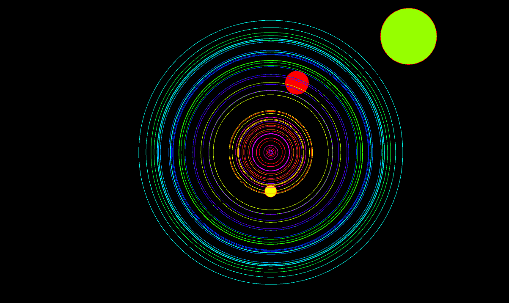
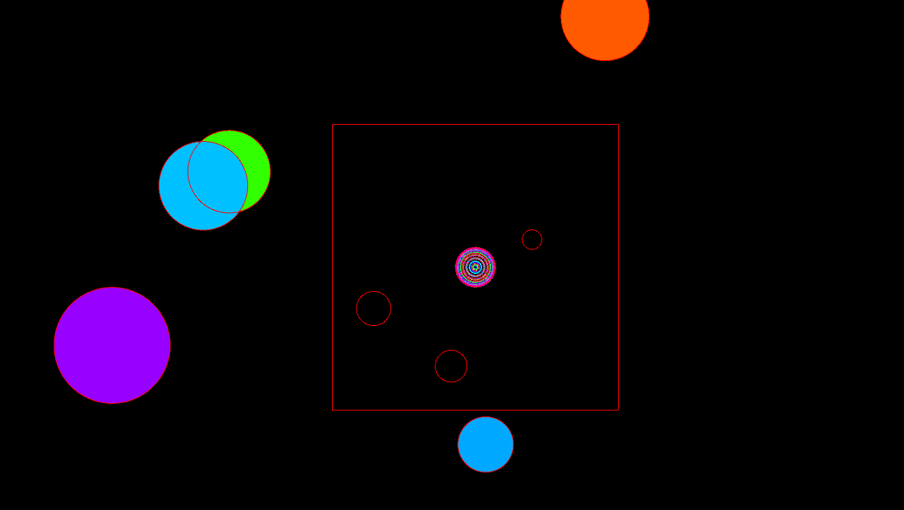
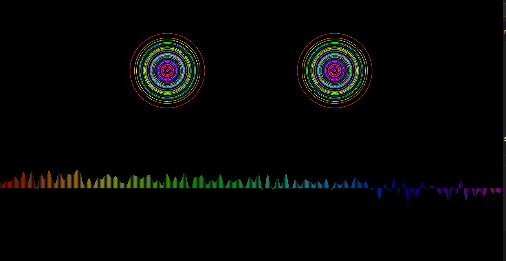

# Music Visualiser Project


# Description of the assignment
- Music Visualiser Project for Object Oriented Programming (OOP) 2024 Semester 2

- (Patrick, Ruben, Jeff, Cormac, Sam)

- multiple audio visualisations that react to the frequency of the music

- each visualisation includes multiple different elements that are reactive to the music

- Scenes are controlled using num keys 1-9


Name: Patrick Fahy

Student Number: C22394713

# How it works
- My First Scene is the Dog with the Large Text that reads "WE'VE GOT TO TRY" as this is the name of the song we are using [hyperlink](https://www.youtube.com/watch?v=mRfSM-lv55I)

- The reason I used the dog as a centerpiece of this scene is because the music video focuses on the story of a dog and how he learns to drive and travels through space.

- My Second Scene is the 3-D Rotating Sphere covered in a mesh grid, which has audio waveforms eminating from both poles of the sphere in both directions. 

- The reason I used this as my second scene is because it looks like the road the dog used to travel through space, and gives a lot of depth to the space around the globe, creating a psychadelic endless highway effect.

# What I am most proud of in the assignment
- I'm most proud of the creative aspect of this project, I was able to express my creativity through the visualisations. I had very specific original ideas which I wanted to carry out and I managed to execute them within the best of my ability.

# Headings
## Headings
#### Headings
##### Headings

This is code for the Dog:

```Java
public void gotToTry() {
    v.beat.detect(v.ap.mix);
    // Check if a second has passed since the last beat
    if (v.millis() - v.lastBeatTime >= 10) {
        if (v.beat.isOnset()) {
            v.background(0); // Change background on beat (once per second)
        }
        v.lastBeatTime = v.millis(); // Update last beat time
    }
    //background(0);
    v.lights();
    float tot = 0;

    for(int i = 0 ; i < v.ap.mix.size() *0.8; i ++)
    {
        tot += v.abs(v.ap.mix.get(i));
    }

    float avg = tot / v.ap.mix.size();
    lerpedAvg = v.lerp(lerpedAvg, avg, 0.1f);
   
    v.pushMatrix();
    v.translate(v.width/2, v.height/1.5f);
    v.rotate(-v.PI);
    v.rotateY(v.theta/2);
    v.scale(2.0f);
    v.shape(v.ball);
    v.popMatrix();
   
   v.fill(v.bgcolor % 255, 255, 255, 100); // Adjust transparency as needed
   String myText = "WE'VE GOT TO TRY";
   v.pushMatrix();

   float textWidth = v.textWidth(v.myText);
    float textHeight = v.textAscent();
    float spacingX = textWidth + 5; // Adjust spacing as needed (5 is for gap between characters)
    float spacingY = textHeight + 5; // Adjust spacing as needed (5 is for gap between lines)
    v.translate(v.width/2, v.height/1.5f);
    v.rotateY(v.theta/2); 

    for (int y = 0; y < v.height; y += spacingY) {
        for (int x = 0; x < v.width; x += spacingX) {
            v.text(v.myText, x, y);
            v.text(v.myText, -x, -y);

        }
    }
    v.popMatrix();
    v.theta += 0.01f + tot/1625;
    v.bgcolor += 0.3 + tot/2;
 }
```


This is code for the Sphere:

```Java
public void BufferSphere()
    {    
        float y = 400;
        float bufferIndex = 0.0f; // Index for smooth looping within the buffer
        PVector lightPosition = new PVector(v.width / 2, v.height / 2, 200);
        float angle = 0; 
        //colorMode(HSB);
        v.background(0);
        v.stroke(v.bgcolor % 255, 255, 255);

        v.lights();
        //background(bgcolor % 255, 255, 255);
        v.background(0);

        // Move light position around the object
        float radius = 200;
    
        v.lightPosition.x = v.width / 2 + PApplet.cos(angle) * radius;
        v.lightPosition.y = v.height / 2 + PApplet.sin(angle) * radius;

        // Update angle for next frame
        angle += 0.01;
        v.bgcolor += 0.3;

        float tot = 0;
        for(int i = 0 ; i < v.ap.mix.size() *0.8; i ++)
        {
            tot += PApplet.abs(v.ap.mix.get(i));
        }

        float avg = tot / v.ap.mix.size();

        // Draw the object (sphere)
        v.translate(v.width / 2, v.height / 2);
        v.rotateY(v.frameCount * 0.01f);
        v.rotateX(v.frameCount * 0.01f);
        v.fill(200, 50, 50);
        v.sphereDetail(30);
        v.sphere(tot);
        
        // Set light position
        v.pointLight(255, 255, 255, v.lightPosition.x, v.lightPosition.y, v.lightPosition.z);

        float h = v.height / 2;
        //float w = width / (float) b.size(); // Width of each segment
        for(int i = 0 ; i < v.width*6; i ++)
        {
            bufferIndex += 0.6f; // Adjust value for line length  +  to get "Speedlines" effect
            float value = v.ap.mix.get((int) Math.floor(bufferIndex) % v.ap.mix.size()); //get buffer values

            float hue = PApplet.map(i, 0, v.ap.mix.size() , 0, 256);
            v.stroke(v.bgcolor % 255, 255, 255);
            v.noFill();
            v.line(i, h, i, h + value * h); // Top waveform line
            v.line(v.width - i, h, v.width - i, h + value * h); // Mirrored waveform line on the opposite side
            v.line(i, -h, i, -h + value * -h);// Draw line on the opposite pole
            v.line(v.width - i, -h, v.width - i, -h + value * -h); // Mirrored waveform line on the opposite side
        }
    }
```


These are screenshots of my second Scene:


These are screenshots of my Second Scene:


This a link to the 'We've Got to Try' Music video on Youtube [hyperlink](https://www.youtube.com/watch?v=mRfSM-lv55I)


This is the youtube video:


Ruben Kenny
c22393366

# How it works
- My first scene shows circles falling towards a pulsating center of concentric circles. They pulse in time with the music. The circles also speed up in time with the music

- This center works by going through a for loop which increments the i value by 10 each time, increasing the radius of each concentric circle. Each circle has a different colour as they're mapped according to their i value relative to the audoio buffer size for their hue. v.ab.get(i) * lerpedAvg * v.height / 2 * 6 describes the radius of each circle. 

- The falling circles are added to an array so they can be manipulated in a for loop. They spawn from a random side of the screen and change their center value based on their distance from the center by the tempo of the music. Their radius is changed based on the mapped value of how for they are from the center, giving the effect of them shrinking

- The second scene is invoked by pressing the n key and having a square eminate from the center. This covers the screen to provide a transition. A face is then made using the pulsating circles again for eyes and a simple waveform as the mouth 


# What I am most proud of in the assignment
- I'm most proud of getting the falling circles to appear to be shrinking and moving in time with the music. I used mapped values and lerping to make this process smooth and create an optical illusion of 3D in a 2D space, as I had invisioned from the outset


This is code for the falling circles:

```Java

for (int i = 0; i < shapes.length; i++) {
            if (shapes[i] == null) {
                break;  // in case of null initialisation
            }
            shapes[i].move(tempo);
            shapes[i].draw();
    }

void addCircle() {
        for (int i = 0; i < shapes.length; i++) {
            if (shapes[i] == null) {
                shapes[i] = new Circle();
                break;
            }
        }
    }


class Circle {
        float centerx;
        float centery;
        float radius = 100f;
        float speedX;
        float speedY;
        float hue; 

        Circle() {
            int side = (int) v.random(1, 4.9f); // left = 1, up = 2, right = 3, down = 4
            if (side == 1) {
                centerx = 0;
                centery = v.random(0, v.height);
            } else if (side == 2) {
                centerx = v.random(0, v.width);
                centery = 0;
            } else if (side == 3) {
                centerx = v.width;
                centery = v.random(0, v.height);
            } else {
                centerx = v.random(0, v.width);
                centery = v.height;
            }
            speedX = (float) (v.width / 2 - centerx) * 0.01f;
            speedY = (float) (v.height / 2 - centery) * 0.01f;
            hue = v.random(256); // Assign random hue value
        }

        void move(float tempo) {
            centerx += speedX * tempo;
            centery += speedY * tempo;
        }

        void draw() {
            // Calculate distance from center
            float distanceFromCenter = v.dist(centerx, centery, v.width / 2, v.height / 2);

            // Map the distance to a radius range (reverse the values)
            float mappedRadius = v.map(distanceFromCenter, 0, v.width / 2, 0, 100);

            // Draw the circle with the mapped radius
            v.fill(hue, 255, 255);
            v.ellipse(centerx, centery, mappedRadius * 2, mappedRadius * 2);

            // Remove the circle if it reaches the center
            if (distanceFromCenter <= 10) {
                removeCircle(this);
            }
        }
    }

void removeCircle(Circle circle) {
        for (int i = 0; i < shapes.length; i++) {
            if (shapes[i] == circle) {
                // Remove the circle
                shapes[i] = null;

                // Shift subsequent circles one position back
                for (int j = i; j < shapes.length - 1; j++) {
                    shapes[j] = shapes[j + 1];
                }
                shapes[shapes.length - 1] = null; // Clear the last element

                break; // Exit the loop once the circle is removed
            }
        }
    }

```

This is code for the falling Pulsating Circles:

```Java
void drawHole() {
        for (int i = 0; i < v.ab.size(); i += 10) {
            // Interpolate the hue value
            float hue = v.map(i, 0, v.ab.size(), 0, 256);
            v.stroke(hue, 255, 255);
            v.noFill();

            // Draw circles using lerpedAvg for size
            v.circle(v.width / 2, v.height / 2, v.ab.get(i) * lerpedAvg * v.height / 2 * 6);
        }
    }
```

This is the code for the expanding square
```Java
if (v.keyPressed && v.key == 'n' && scene1) {
            theVoid.expanding = true; // Start expanding the square
            theVoid.startTime = v.millis(); // Record the start time
        }

        if (theVoid.expanding) {

            if (v.millis() - theVoid.startTime >= theVoid.duration) {  // the void has covered the screen
                scene1 = false; 
                scene2 = true;  // Switch the screen
            }
        }
class Square {
        float startX;
        float startY;
        float endX;
        float endY;
        float duration = 2000; // 2 seconds duration for expansion
        float startTime;
        boolean expanding = false;

        Square() {
            startX = v.width / 2;
            startY = v.height / 2;
            endX = v.width / 2;
            endY = v.height / 2;
        }
        

        void expand() {
            float elapsedTime = v.millis() - startTime;
            float progress = elapsedTime / duration; // Calculate the progress of expansion
    
            // Interpolate current position based on progress
            float currentX = v.lerp(startX, endX, progress);
            float currentY = v.lerp(startY, endY, progress);
    
            // Calculate current size based on progress
            float currentSize = v.lerp(0, v.max(v.width, v.height), progress);
    
            // Draw the expanding square
            v.fill(0); // Set fill color to black
            v.rectMode(v.CENTER);
            v.rect(currentX, currentY, currentSize, currentSize);
    
            // Check if expansion is complete
            if (elapsedTime >= duration) {
                expanding = false; // Set expanding flag to false
            }
        }
        
        
        
        
    }
```

Here are some screenshots of the scenes






# Music Visualiser Project

Name:

Student Number: 

# How it works

# What I am most proud of in the assignment

# Headings
## Headings
#### Headings

This is code:

```Java
public void render()
{
	ui.noFill();
	ui.stroke(255);
	ui.rect(x, y, width, height);
	ui.textAlign(PApplet.CENTER, PApplet.CENTER);
	ui.text(text, x + width * 0.5f, y + height * 0.5f);
}
```

This is an image using a relative URL:


This is a [hyperlink](http://bryanduggan.org)


This is a youtube video:

[](https://www.youtube.com/watch?v=J2kHSSFA4NU)
